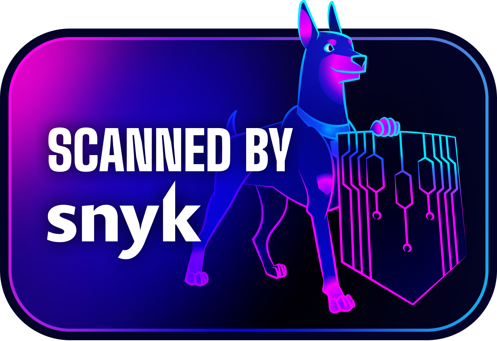

# ✏️ Diagramahub

[](https://snyk.io/test/github/diagramahub/diagramahub?targetFile=frontend/package.json)


**Diagramahub** is an open-source platform for creating, organizing, and exporting diagrams using plain text markup. It combines the power of Mermaid, PlantUML, and D2 with a polished interface — ideal for developers and teams who want to diagram fast and stay in flow.

Server-side rendering powered by [Kroki](https://kroki.io/). Self-hostable via Docker Compose. No vendor lock-in. Apache 2.0 licensed.

> ⚠️ **Beta Software** — DiagramaHub is in early development (v0.x). APIs, data structures, and features may change between versions. Use in production at your own risk.

---

## ✨ Features

- 📝 **Mermaid, PlantUML & D2** — real-time text-to-diagram rendering with syntax validation, powered by [Kroki](https://kroki.io/) (20+ diagram types, your content stays private).
- 🖥️ **Monaco Editor** — full code editor with syntax highlighting, themes (Mermaid/PlantUML/D2), and presentation mode.
- 🖼️ **Export** — PNG, SVG, PDF, and Markdown.
- 🤖 **AI-Powered (BYOL)** — bring your own LLM (Gemini, OpenAI, Claude, DeepSeek) to generate, improve, fix, and chat-refine diagrams.
- 📂 **Organization** — projects, folders, and shareable public links with access codes and rate limiting.
- 🔒 **Secure platform** — JWT + MFA auth, Stripe subscriptions, multi-language (ES/EN), and audit logging. See [SECURITY.md](SECURITY.md).
- 🐳 **Docker Ready** — self-host anywhere in minutes with the one-line installer.

---

## 🚀 Quickstart

### Automatic Install (Recommended)

```bash
bash <(curl -fsSL https://raw.githubusercontent.com/diagramahub/diagramahub/main/install.sh)
```

The installer detects your OS, installs Docker if needed, configures MongoDB (local or external), generates secrets, and starts everything.

### Manual Install

```bash
git clone https://github.com/diagramahub/diagramahub.git
cd diagramahub

# Configure environment
cp backend/.env.example backend/.env
# Edit backend/.env — set JWT_SECRET at minimum

# Choose deployment mode
ln -sf deploy/local-full/docker-compose.yml docker-compose.yml

# Build and start
docker-compose up -d --build
```

Once running:

| Service | URL |
|---|---|
| Frontend | http://localhost:5173 |
| Backend API | http://localhost:5172 |
| Swagger UI | http://localhost:5172/docs |
| ReDoc | http://localhost:5172/redoc |

For production deployment (Nginx/SSL), upgrades, and troubleshooting, see the **[Installation Guide](INSTALL.md)**.

---

## 🏗️ Architecture

Modular monorepo following **SOLID** principles: a **React 19 + Vite 7** frontend, a **FastAPI + MongoDB** backend, and **[Kroki](https://kroki.io/)** for server-side diagram rendering — all orchestrated with Docker Compose.

📐 Full breakdown (modules, services, layout) in **[ARCHITECTURE.md](ARCHITECTURE.md)**.

---

## 🛡️ Secure by design

<table>
<tr>
<td width="200"></td>
<td>Security is a foundational principle at Diagramahub. Every layer of the stack — from the database to the browser — has been hardened with multiple overlapping controls.</td>
</tr>
</table>

MFA, encrypted API keys, audit logging, brute-force protection, and production hardening across the stack. We continuously monitor dependencies and code with [Snyk](https://snyk.io/) through their Secure Developer Program for Open Source.

🔐 Full controls and vulnerability reporting in **[SECURITY.md](SECURITY.md)**.

---

## 📖 Documentation

- 🛠️ **[Installation & Update Guide](INSTALL.md)** — setup, production deployment (Nginx/SSL), troubleshooting, and upgrades.
- 🏗️ **[Architecture](ARCHITECTURE.md)** — modules, services, and tech stack.
- 🛡️ **[Security](SECURITY.md)** — security controls and vulnerability reporting.
- 💳 **[Stripe Quickstart](STRIPE_QUICKSTART.md)** — configure subscriptions and billing.
- 📖 **[Backend](backend/README.md)** · **[Frontend](frontend/README.md)** — layer-specific docs.
- 📚 **[Full Documentation](docs/)** — MkDocs Material site (ES/EN).

---

## 🧪 Testing

```bash
docker exec diagramahub-backend poetry run pytest        # unit tests + coverage
docker exec diagramahub-backend poetry run ruff check app/
```

More test markers and shell-based scripts are documented in the [Installation Guide](INSTALL.md).

---

## 🙌 Contributing

We welcome contributions! Please check the development guidelines in the [Installation Guide](INSTALL.md).

---

## ⭐ Star History

[](https://www.star-history.com/#diagramahub/diagramahub&Date)

---

## 📋 Changelog

See [CHANGELOG.md](CHANGELOG.md) for a detailed history of changes.

---

## 📜 License

Licensed under the [Apache License 2.0](LICENSE).

---

## 🧠 Made with care by [@alexdzul](https://github.com/alexdzul) and contributors
